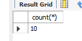
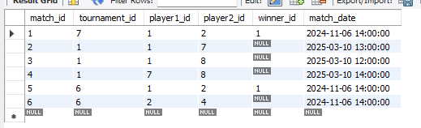
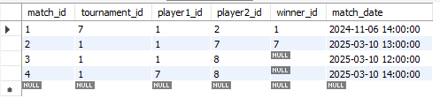

# DB_OLA1

First OLA of Software development.

## TASK 1: Databasedesign og oprettel

se af databasen

### Script til oprettelse af database:

```sql
CREATE DATABASE  IF NOT EXISTS `esport`;
USE `esport`;

-- tables

DROP TABLE IF EXISTS `players`;
CREATE TABLE `players` (
  `player_id` int NOT NULL AUTO_INCREMENT,
  `username` varchar(45) NOT NULL,
  `email` varchar(45) NOT NULL,
  `ranking` int DEFAULT '0',
  `created_at` datetime DEFAULT NULL,
  PRIMARY KEY (`player_id`),
  UNIQUE KEY `username_UNIQUE` (`username`),
  UNIQUE KEY `email_UNIQUE` (`email`)
) ENGINE=InnoDB AUTO_INCREMENT=1 DEFAULT CHARSET=utf8mb4 COLLATE=utf8mb4_0900_ai_ci;

DROP TABLE IF EXISTS `tournaments`;
CREATE TABLE `tournaments` (
  `tournament_id` int NOT NULL AUTO_INCREMENT,
  `name` varchar(45) NOT NULL,
  `game` varchar(45) NOT NULL,
  `max_players` int NOT NULL,
  `start_date` datetime NOT NULL,
  `created_at` datetime NOT NULL,
  PRIMARY KEY (`tournament_id`)
) ENGINE=InnoDB AUTO_INCREMENT=1 DEFAULT CHARSET=utf8mb4 COLLATE=utf8mb4_0900_ai_ci;

DROP TABLE IF EXISTS `matches`;
CREATE TABLE `matches` (
  `match_id` int NOT NULL AUTO_INCREMENT,
  `tournament_id` int NOT NULL,
  `player1_id` int NOT NULL,
  `player2_id` int NOT NULL,
  `winner_id` int DEFAULT NULL,
  `match_date` datetime DEFAULT NULL,
  PRIMARY KEY (`match_id`),
  KEY `tournament_id_idx` (`tournament_id`),
  KEY `player_id_idx` (`player1_id`),
  KEY `player2_id_idx` (`player2_id`),
  KEY `winnder_id_idx` (`winner_id`),
  CONSTRAINT `match_tournament_id` FOREIGN KEY (`tournament_id`) REFERENCES `tournaments` (`tournament_id`),
  CONSTRAINT `player1_id` FOREIGN KEY (`player1_id`) REFERENCES `players` (`player_id`),
  CONSTRAINT `player2_id` FOREIGN KEY (`player2_id`) REFERENCES `players` (`player_id`),
  CONSTRAINT `winnder_id` FOREIGN KEY (`winner_id`) REFERENCES `players` (`player_id`)
) ENGINE=InnoDB DEFAULT CHARSET=utf8mb4 COLLATE=utf8mb4_0900_ai_ci AUTO_INCREMENT=1;


DROP TABLE IF EXISTS `tournament_registrations`;
CREATE TABLE `tournament_registrations` (
  `registration_id` int NOT NULL AUTO_INCREMENT,
  `registered_at` datetime NOT NULL,
  `tournament_id` int NOT NULL,
  `player_id` int NOT NULL,
  PRIMARY KEY (`registration_id`),
  KEY `tournament_id_idx` (`tournament_id`),
  KEY `player_id_idx` (`player_id`),
  CONSTRAINT `player_id` FOREIGN KEY (`player_id`) REFERENCES `players` (`player_id`),
  CONSTRAINT `tournament_id` FOREIGN KEY (`tournament_id`) REFERENCES `tournaments` (`tournament_id`)
) ENGINE=InnoDB DEFAULT CHARSET=utf8mb4 COLLATE=utf8mb4_0900_ai_ci AUTO_INCREMENT=1;

-- triggers:

DELIMITER $$

CREATE TRIGGER set_created_at
BEFORE INSERT ON players
FOR EACH ROW 
BEGIN
    IF NEW.created_at IS NULL THEN
		SET NEW.created_at = NOW();
	END IF;
END $$

DELIMITER ; 

DELIMITER $$

CREATE TRIGGER set_created_at_tournaments
BEFORE INSERT ON tournaments
FOR EACH ROW 
BEGIN
    IF NEW.created_at IS NULL THEN
		SET NEW.created_at = NOW();
	END IF;
END $$

DELIMITER ; 

DELIMITER //
create trigger beforeInsertRegistration
before insert on tournament_registrations
for each row
begin
	declare playerCount int;
    declare maxPlayers int;

    select count(*) into playerCount from tournament_registrations where tournament_id = NEW.tournament_id;
    select max_players into maxPlayers from tournaments where tournament_id = NEW.tournament_id;

    IF playerCount>= maxPlayers then
		signal sqlstate '45000' set message_text = 'Tournament Full';

    end if;

end //

DELIMITER ;

DELIMITER //
create trigger afterInsertMatch
after update on matches
for each row
begin
    
    DECLARE player1_ranking INT;
    DECLARE player2_ranking INT;
    
    SELECT RANKING INTO player1_ranking FROM players WHERE player_id = new.player1_id;
    SELECT RANKING INTO player2_ranking FROM players WHERE player_id = new.player2_id;
    
    if new.winner_id = new.player1_id then
		update players set ranking = ranking + 10 where player_id = new.player1_id;
        if player2_ranking >= 10 then
			update players set ranking = ranking - 10 where player_id = new.player2_id;
		else
			update players set ranking = 0 where player_id = new.player2_id;
		end if;
	elseif new.winner_id = new.player2_id then
		update players set ranking = ranking + 10 where player_id = new.player2_id;
        if player1_ranking >= 10 then
			update players set ranking = ranking - 10 where player_id = new.player1_id;
		else
			update players set ranking = 0 where player_id = new.player1_id;
		end if;
    end if;
end //

DELIMITER ;

-- procedures

DELIMITER //

CREATE PROCEDURE joinTournament(
    IN p_player_id INT,
    IN p_tournament_id INT
)
BEGIN
    IF EXISTS (
		SELECT 1
        FROM tournament_registrations
        WHERE tournament_id = p_tournament_id
        AND player_id = p_player_id
    )THEN
		signal sqlstate '45000' set message_text = 'Player has already registered to that tournament.';
    ELSE
        insert into tournament_registrations (player_id, tournament_id, registered_at)
        values (p_player_id, p_tournament_id, NOW());
    END IF;
END //

DELIMITER ;

DELIMITER //

CREATE PROCEDURE registerPlayer(
    IN p_username VARCHAR(45),
    IN p_email VARCHAR(45),
    IN p_ranking INT(10)
)
BEGIN
    INSERT INTO players (username, email, ranking, created_at)
    VALUES (p_username, p_email, p_ranking, NOW());
END //

DELIMITER ;

DELIMITER //

CREATE PROCEDURE submitMatchResult(
    IN p_match_id INT,
    IN p_winner_id INT
)
BEGIN
    IF EXISTS(
        SELECT 1
        FROM matches
        WHERE match_id = p_match_id
        AND (player1_id = p_winner_id OR player2_id = p_winner_id)
    ) THEN
        UPDATE matches
        SET winner_id = p_winner_id
        WHERE match_id = p_match_id;
    ELSE
        signal sqlstate '45000' set message_text = 'Winner is not a participant of this match.';
    END IF;

END //

DELIMITER ;

-- functions:

DELIMITER //
create function getTotalWins(playerID int) returns int
deterministic
begin
    declare totalWins int;

    select COUNT(*) into totalWins
    from matches
    where winner_id = playerID;

    return totalWins;
end //
DELIMITER ;

DELIMITER //
create function getTournamentStatus(tournamentID INT) RETURNS VARCHAR(20)
DETERMINISTIC
begin
    declare tournamentStart date;
    declare tournamentEnd date;
    DECLARE status VARCHAR(20);

    -- Get tournament start date
    SELECT start_date INTO tournamentStart FROM tournaments WHERE tournament_id = tournamentID;

    -- If no matches have been played, it's "upcoming"
    IF tournamentStart > CURDATE() THEN
        SET status = 'upcoming';
    -- If there are matches but no winner for all matches, it's "ongoing"
    ELSEIF EXISTS (SELECT 1 FROM matches WHERE tournament_id = tournamentID AND winner_id IS NULL) THEN
        SET status = 'ongoing';
    ELSE
        SET status = 'completed';
    END IF;

    RETURN status;
END //
DELIMITER ;

-- Test data:

INSERT INTO esport.players(username, email, ranking) 
VALUES 
('maverick', 'm@test.dk', 0), 
('gobsmacked', 'g@test.dk', 100), 
('flume', 'f@test.dk', 200), 
('ranivorous', 'r@test.dk', 150), 
('phalange', 'p@test.dk', 2000), 
('sprout','s@test.dk', 175), 
('bulbous', 'b@test.dk', 50),
('drizzle', 'd@test.dk', 0),
('wharf', 'w@test.dk', 80),
('Jackster', 'j@test.dk', 1250);

INSERT INTO esport.tournaments(name, game, max_players, start_date) 
VALUES
('Free Fire', 'CS', 100, '2025-03-10 12:00:00'),
('COBX Masters', 'LOL', 325, '2025-06-20 20:00:00'),
('PUBG Championships', 'PUBG', 120, '2025-04-15 08:00:00'),
('Cybergamer', 'DOTA', 50,'2026-04-09 15:00:00'),
('Evolution Championships','CS', 80,'2026-01-01 08:00:00'),
('Hero Pro League', 'HON', 30, '2024-12-24 18:00:00'),
('League Gaming', 'LOL', 50, '2024-11-06 14:00:00');

INSERT esport.tournament_registrations(registered_at, tournament_id, player_id)
VALUES
('2024-11-05 14:00:00', 7, 1),
('2024-11-04 14:00:00', 7, 2),
('2025-03-02 12:00:00', 1, 1),
('2025-03-02 12:00:00', 2, 1),
('2025-03-02 12:00:00', 4, 7),
('2025-03-02 12:00:00', 4, 10),
('2025-03-02 12:00:00', 1, 7),
('2025-03-02 12:00:00', 1, 8),
('2025-03-02 12:00:00', 2, 9),
('2025-03-02 12:00:00', 3, 2),
('2025-03-02 12:00:00', 1, 6),
('2025-03-02 12:00:00', 1, 5),
('2025-03-02 12:00:00', 4, 1);

INSERT INTO esport.matches(tournament_id, player1_id, player2_id, match_date, winner_id)
VALUES
(7, 1, 2, '2024-11-06 14:00:00', 1),
(1, 1, 7, '2025-03-10 13:00:00', null),
(1, 1, 8, '2025-03-10 12:00:00', null),
(1, 7, 8, '2025-03-10 14:00:00', null);
```

### Sådan ser databasen ud efter creation scriptet er kørt:

Players:


Tournaments:


Tournament_registrations:


Matches:


## Task 2: SQL-Forespørgsler

### 2.1 Hent alle turneringer, der starter inden for de næste 30 dage.

```sql
select * from tournaments
WHERE start_date BETWEEN CURDATE()
AND DATE_ADD(CURDATE(), INTERVAL 30 DAY);
```

Resultat:


### 2.2 Find det antal turneringer, en spiller har deltaget i.

```sql
select count(*) from tournament_registrations
where player_id = 1;
```

Resultat:


### 2.3 Vis en liste over spillere registreret i en bestemt turnering.

```sql
SELECT p.player_id, p.username from players p
JOIN tournament_registrations tr on p.player_id = tr.player_id
where tr.tournament_id = 1;
```

Resultat:


### 2.4 Find spillere med flest sejre i en bestemt turnering.

```sql
select player_id, username, sum(case when players.player_id = matches.winner_id then 1 else 0 end) as w
from players
left join matches
on players.player_id = matches.player1_id or players.player_id = matches.player2_id
where matches.tournament_id = 7
group by players.player_id order by w DESC;
```

Resultat:


### 2.5 Hent alle kampe, hvor en bestemt spiller har deltaget.

```sql
select * from matches
where player1_id = 1
or player2_id = 1;
```

Resultat:


### 2.6 Hent en spillers tilmeldte turneringer.

```sql
Select t.tournament_id, t.name from tournaments as t
JOIN tournament_registrations as tr
ON t.tournament_id = tr.tournament_id
where tr.player_id = 1;
```

Resultat:


### 2.7 Find de 5 bedst rangerede spillere.

```sql
select username, ranking from players order by ranking DESC limit 5;
```

Resultat:


### 2.8 Beregn gennemsnitlig ranking for alle spillere.

```sql
select avg(ranking) from players;
```

Resultat:


### 2.9 Vis turneringer med mindst 5 deltagere.

```sql
SELECT t.tournament_id, t.name, t.game, COUNT(tr.player_id) AS num_players
FROM tournaments t
JOIN tournament_registrations tr ON t.tournament_id = tr.tournament_id
GROUP BY t.tournament_id
HAVING num_players >= 5;
```

Resultat:


### 2.10 Find det samlede antal spillere i systemet.

```sql
select count(*) from players;
```

Resultat:



### 2.11 Find alle kampe, der mangler en vinder.

```sql
select * from matches where winner_id IS NULL;
```

Resultat:


### 2.12 Vis de mest populære spil baseret på turneringsantal.

```sql
select game, count(tournament_id) as numOfTourneys
from tournaments
group by game
order by numOfTourneys DESC;
```

Resultat:


### 2.13 Find de 5 nyeste oprettede turneringer.

```sql
select * from tournaments
order by created_at limit 5;
```

Resultat:


### 2.14 Find spillere, der har registreret sig i flere end 3 turneringer.

```sql
select p.player_id, p.username, COUNT(tr.tournament_id) as registrations
from tournament_registrations as tr
join players p on tr.player_id = p.player_id
group by p.player_id
having registrations > 3;
```

Resultat:


### 2.15 Hent alle kampe i en turnering sorteret efter dato.

```sql
select * from matches
where tournament_id = 1
order by match_date;
```

Resultat:


## Task 3 Stored procedures, functions og triggers

### 3.1 Stored Procedures

##### 3.1.1 registerPlayer

```
DELIMITER //

CREATE PROCEDURE registerPlayer(
    IN p_username VARCHAR(45),
    IN p_email VARCHAR(45),
    IN p_ranking INT(10)
)
BEGIN
    INSERT INTO players (username, email, ranking, created_at)
    VALUES (p_username, p_email, p_ranking, NOW());
END //

DELIMITER ;
```

DB state før proceduren køres:


```sql
CALL registerPlayer('Asher', 'a@test.dk', 0);
```

State efter proceduren er kørt:


##### 3.1.2 joinTournament

```
DELIMITER //

CREATE PROCEDURE joinTournament(
    IN p_player_id INT,
    IN p_tournament_id INT
)
BEGIN
    IF EXISTS (
		SELECT 1
        FROM tournament_registrations
        WHERE tournament_id = p_tournament_id
        AND player_id = p_player_id
    )THEN
		signal sqlstate '45000' set message_text = 'Player has already registered to that tournament.';
    ELSE
        insert into tournament_registrations (player_id, tournament_id, registered_at)
        values (p_player_id, p_tournament_id, NOW());
    END IF;
END //

DELIMITER ;
```

DB state før proceduren køres:


```sql
CALL joinTournament(1, 1);
```


```sql
CALL joinTournament(1, 3);
```

DB state efter proceduren er kørt:


##### 3.1.3 submitMatchResult

```
DELIMITER //

CREATE PROCEDURE submitMatchResult(
    IN p_match_id INT,
    IN p_winner_id INT
)
BEGIN
    IF EXISTS(
        SELECT 1
        FROM matches
        WHERE match_id = p_match_id
        AND (player1_id = p_winner_id OR player2_id = p_winner_id)
    ) THEN
        UPDATE matches
        SET winner_id = p_winner_id
        WHERE match_id = p_match_id;
    ELSE
        signal sqlstate '45000' set message_text = 'Winner is not a participant of this match.';
    END IF;

END //

DELIMITER ;
```

DB state før proceduren køres:


```sql
CALL submitMatchResult(2, 7);
```

DB state efter proceduren er kørt:


```sql
CALL submitMatchResult(2, 3);
```


### 3.2 Functions

##### 3.2.1 getTotalWins(player_id)

```
DELIMITER //
create function getTotalWins(playerID int) returns int
deterministic
begin
    declare totalWins int;

    select COUNT(*) into totalWins
    from matches
    where winner_id = playerID;

    return totalWins;
end //
DELIMITER ;
```

#### Test foretaget baseret på følgende DB state:


```sql
SELECT getTotalWins(1);
```

Resultat:


Testen viser at spiller 1 har 1 win, som det også fremgår af matches tabellen.

```sql
SELECT getTotalWins(2);
```

Resultat:


Testen viser at spiller 2 har 0 wins, som det også fremgår af matches tabellen.

```sql
SELECT getTotalWins(5);
```

Resultat:


Denne test viser at spiller 5 har 0 wins, og har til hensigt at testen stadig giver at gyldigt resultat når der kommer forespørgsler på spillere som ikke har deltaget i nogle matches.

##### 3.2.2 getTournamentStatus(tournament_id)

```
DELIMITER //
create function getTournamentStatus(tournamentID INT) RETURNS VARCHAR(20)
DETERMINISTIC
begin
    declare tournamentStart date;
    declare tournamentEnd date;
    DECLARE status VARCHAR(20);

    -- Get tournament start date
    SELECT start_date INTO tournamentStart FROM tournaments WHERE tournament_id = tournamentID;

    -- If no matches have been played, it's "upcoming"
    IF tournamentStart > CURDATE() THEN
        SET status = 'upcoming';
    -- If there are matches but no winner for all matches, it's "ongoing"
    ELSEIF EXISTS (SELECT 1 FROM matches WHERE tournament_id = tournamentID AND winner_id IS NULL) THEN
        SET status = 'ongoing';
    ELSE
        SET status = 'completed';
    END IF;

    RETURN status;
END //
DELIMITER ;
```

#### Test foretaget baseret på følgende DB state (ekstra indsat match på tournament 6 for at kunne teste alle outcomes):

Tournaments state:


Matches state:



```sql
SELECT getTournamentStatus(6);
```

Resultat:


```sql
SELECT getTournamentStatus(7);
```

Resultat:


```sql
SELECT getTournamentStatus(1);
```

Resultat:


Test foretaget d. 04-03-2025.
Resultaterne matcher altså forventningerne, da turnering 6 og 7 ligger i fortiden, hvor turnering 6 stadig har en uafsluttet match, og turnering 1 ligger i fremtiden.

### 3.3 Triggers

##### 3.3.1 beforeInsertRegistration

```
DELIMITER //
create trigger beforeInsertRegistration
before insert on tournament_registrations
for each row
begin
	declare playerCount int;
    declare maxPlayers int;

    select count(*) into playerCount from tournament_registrations where tournament_id = NEW.tournament_id;
    select max_players into maxPlayers from tournaments where tournament_id = NEW.tournament_id;

    IF playerCount>= maxPlayers then
		signal sqlstate '45000' set message_text = 'Tournament Full';

    end if;

end //

DELIMITER ;
```

DB state før triggeren køres:

Tournaments state:


Registrations state:


```sql
CALL joinTournament(1, 3);
```

Resultat:


```sql
CALL joinTournament(9, 1);
```

Resultat:


##### 3.3.2 afterInsertMatch

```
DELIMITER //
create trigger afterInsertMatch
after update on matches
for each row
begin

    DECLARE player1_ranking INT;
    DECLARE player2_ranking INT;

    SELECT RANKING INTO player1_ranking FROM players WHERE player_id = new.player1_id;
    SELECT RANKING INTO player2_ranking FROM players WHERE player_id = new.player2_id;

    if new.winner_id = new.player1_id then
		update players set ranking = ranking + 10 where player_id = new.player1_id;
        if player2_ranking >= 10 then
			update players set ranking = ranking - 10 where player_id = new.player2_id;
		else
			update players set ranking = 0 where player_id = new.player2_id;
		end if;
	elseif new.winner_id = new.player2_id then
		update players set ranking = ranking + 10 where player_id = new.player2_id;
        if player1_ranking >= 10 then
			update players set ranking = ranking - 10 where player_id = new.player1_id;
		else
			update players set ranking = 0 where player_id = new.player1_id;
		end if;
    end if;
end //

DELIMITER ;
```

DB state før triggeren køres:

Players state:


Matches state:


```sql
CALL submitMatchResult(2, 1);
```

Resultat:


Testen her viser spiller 1 som har vundet er kommet op på 10 ranking, mens spiller 7 som tabte har mistet 10, og nu har en samlet ranking på 40.

#### DB state sat tilbage til udgangspunktet før forrige test.

```sql
CALL submitMatchResult(4, 7);
```

Resultat:


Denne test viser at hvis en spiller taber en match, og deres ranking er under 10, så vil deres ranking blive sat til 0.
Spiller 7 får altså ranking, mens spiller 8 ikke kan miste mere, da rankingen allerede er 0.

## Task 4: Brug af databasen fra en applikation

Brug applikationen til at kalde stored procedures joinTournament og submitMatchResult.

Udfør samme funktionalitet uden brug af stored procedures.

Forbindelsen til databasen oprettes via følgende dependency:

```xml
<dependency>
    <groupId>mysql</groupId>
    <artifactId>mysql-connector-java</artifactId>
    <version>8.0.33</version>
</dependency>
```

### 4.1 joinTournament

DB state før proceduren køres:


#### Udført med stored procedure:

```java
public static void joinTournament(int playerId, int tournamentId) {
        try (Connection conn = DriverManager.getConnection(URL, USER, PASSWORD);
             CallableStatement stmt = conn.prepareCall("{CALL joinTournament(?, ?)}")) {

            stmt.setInt(1, playerId);
            stmt.setInt(2, tournamentId);
            stmt.execute();

            System.out.println("Player registered successfully.");
        } catch (SQLException e) {
            System.err.println("Database error: " + e.getMessage());
        }
    }
```

```java
public static void main(String[] args) {
    Procedures.joinTournament(1, 5);
}
```

Resultat:


```java
public static void main(String[] args) {
    Procedures.joinTournament(1, 7);
}
```

DB state sat tilbage til udgangspunktet for denne opgave.

Resultat:


#### Udført uden stored procedure:

```java
    public static void joinTournamentPreparedStatement(int playerId, int tournamentId) {

        try (Connection conn = DriverManager.getConnection(URL, USER, PASSWORD);
             PreparedStatement checkStmt = conn.prepareStatement("SELECT 1 FROM tournament_registrations WHERE tournament_id = ? AND player_id = ?");
             PreparedStatement insertStmt = conn.prepareStatement("INSERT INTO tournament_registrations (player_id, tournament_id, registered_at) VALUES (?, ?, NOW())")) {

            // Check if player is already registered
            checkStmt.setInt(1, tournamentId);
            checkStmt.setInt(2, playerId);
            ResultSet rs = checkStmt.executeQuery();

            if (rs.next()) {
                System.out.println("Player has already registered for the tournament.");
                return;  // Stop execution if player is already registered
            }

            // Insert new registration
            insertStmt.setInt(1, playerId);
            insertStmt.setInt(2, tournamentId);
            int rowsAffected = insertStmt.executeUpdate();

            if (rowsAffected > 0) {
                System.out.println("Player registered successfully.");
            } else {
                System.out.println("Registration failed.");
            }

        } catch (SQLException e) {
            System.err.println("Database error: " + e.getMessage());
        }
    }
```

```java
public static void main(String[] args) {
    Procedures.joinTournamentPreparedStatement(1, 7);
}
```

Resultat:


Fejlhåndtering denne gang fra java siden, der modtages altså ikke en SQL exception.

```java
public static void main(String[] args) {
    Procedures.joinTournamentPreparedStatement(3, 1);
}
```

Resultat:


### 4.2 submitMatchResult

DB state før proceduren køres:


#### Udført med stored procedure:

```java
public static void submitMatchResult(int match_id, int winner_id) {
        try (Connection conn = DriverManager.getConnection(URL, USER, PASSWORD);
             CallableStatement stmt = conn.prepareCall("{CALL submitMatchResult(?, ?)}")) {

            stmt.setInt(1, match_id);
            stmt.setInt(2, winner_id);
            stmt.execute();

            System.out.println("Match result submitted successfully.");
        } catch (SQLException e) {
            System.err.println("Database error: " + e.getMessage());
        }
    }
```

```java
public static void main(String[] args) {
    Procedures.submitMatchResult(2, 7);
}
```

Resultat:




```java
public static void main(String[] args) {
    Procedures.submitMatchResult(2, 3);
}
```

DB state sat tilbage til udgangspunktet for denne opgave.

Resultat:


#### Udført uden stored procedure:

```java
    public static void submitMatchResultPreparedStatement(int match_id, int winner_id) {

    try (Connection conn = DriverManager.getConnection(URL, USER, PASSWORD);
         PreparedStatement playerids = conn.prepareStatement("SELECT player1_id, player2_id FROM matches WHERE match_id = ?");
         PreparedStatement insertStmt = conn.prepareStatement("UPDATE matches SET winner_id = ? WHERE match_id = ?")) {

        playerids.setInt(1, match_id);
        ResultSet prs = playerids.executeQuery();
        if (prs.next()){
            int player1_id = prs.getInt("player1_id");
            int player2_id = prs.getInt("player2_id");
            if (winner_id != player1_id && winner_id != player2_id){
                System.out.println("Winner id is not a player in the match");
                return;
            }
        }


        // Insert new registration
        insertStmt.setInt(1, winner_id);
        insertStmt.setInt(2, match_id);
        int rowsAffected = insertStmt.executeUpdate();

        if (rowsAffected > 0) {
            System.out.println("Match result submitted.");
        } else {
            System.out.println("Match result failed while submitting.");
        }

    } catch (SQLException e) {
        System.err.println("Database error: " + e.getMessage());
    }
}
```

```java
public static void main(String[] args) {
    Procedures.submitMatchResultPreparedStatement(4, 1);
}
```

Resultat:


```java
public static void main(String[] args) {
    Procedures.submitMatchResultPreparedStatement(2, 1);
}
```


## Task 5: Fordele og ulemper ved brugen af SQL programmering

I følgende fil vil vi kort beskrive tankerne bag programmering i SQL og hvilke fordele og ulemper vi har oplevet.

### Fordele

SQL programmering kan være super smart, hvis man bruger det korrekt og implementerer gode kodestykker.

Det kan være nyttigt i firmaer, hvor man benytter mange forskellige platforme til den samme database, da man kan lave stored procedures og functions, der sikrer ensartet datahåndtering og behandling på tværs af systemer. Dette skaber en mere robust arkitektur, hvor logikken kan placeres direkte i databasen i stedet for i den enkelte applikation.

Derudover kan SQL-forespørgsler være optimeret til at håndtere store mængder data hurtigt, især hvis man anvender korrekt indeksering og normalisering.

Sikkerhedsmæssigt kan det være en fordel, fordi du kan give brugere adgang til stored procedures (som man derved har fuld kontrol over) - en kompromitteret bruger kan altså lave mindre rav i den, hvis den kun har adgang til udvalgte forudbestemte procedures og functions, end hvis der er fuld adgang til CRUD operationer.

### Ulemper

SQL kan som sprog være et stort spring nedad ift. programmeringslogik, især for udviklere, da vi er vant til funktionelle eller objektorienterede sprog som Java eller C#. SQL, som er deklarativt, hvor man beskriver, hvad man vil have i stedet for at definere, hvordan det skal udføres, kan føles uintuitivt at arbejde med.

Derudover kan stored procedures og triggers blive svære at debugge, og kan være mindre gennemsigtige end kode i et almindeligt programmeringssprog. Kompleks SQL-logik kan også gøre systemet mindre fleksibelt, hvis meget af forretningslogikken bliver låst fast i databasen i stedet for i applikationerne.

Man skal være opmærksom på kædereaktioner, især fra triggers, fordi de kan have uventede konsekvenser hvis triggers aktiverer adskillelige andre triggers.

Endelig kræver optimering af SQL-forespørgsler forståelse for joins og caching, hvilket kan være en udfordring for mindre erfarne udviklere. Hvis databasen ikke er designet korrekt fra starten, kan man hurtigt opleve performanceproblemer, især ved store datamængder.